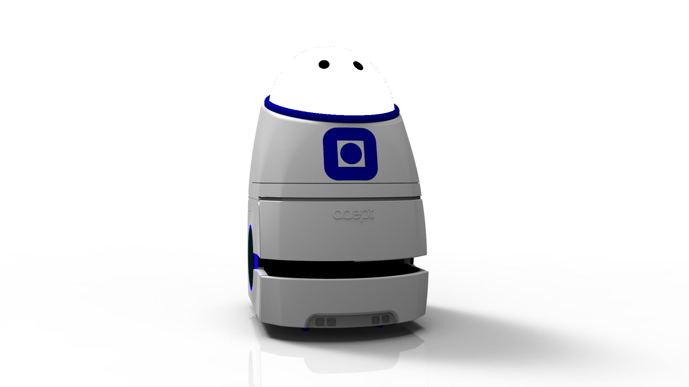

# CADs

## Pioneer LX and body
The body is created in Solidworks as part of an EiT project V2018. 

## Rack
The rack/skeleton is a project done by EiT V2015. A newer version of the rack is in the Pioneer LX and body folder.

## Goal robot
